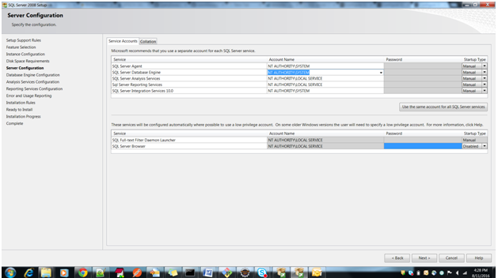
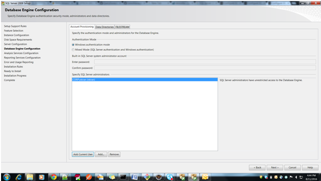
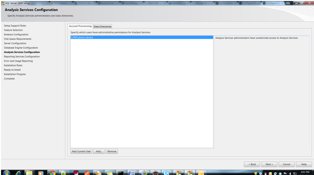
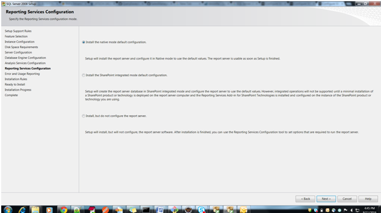

:toc: macro
toc::[]

##Guide for DBIntegration of MS SQL Server 2008

devon4j is by default configured with the H2 Databse.  

## MSSQL Installation and Configuration using Docker

We can now use SQL Server in Linux and run it easily using docker executing:
[source,bash]
--------
docker run --name mssql -e 'ACCEPT_EULA=Y' -e 'SA_PASSWORD=Passw0rd' -p 1433:1433 -d microsoft/mssql-server-linux
--------

This makes MSSQL avaiable on the docker-machine host on port 1433. If using docker on windows with docker toolbox it usually means that MSSQL will be on 192.168.99.100 (please check the IP of your docker machine)

So the configuration for the datasource url strig will be: 

`jdbc:sqlserver://192.168.99.100:1433;databaseName=restaurant`

There are no client tools on this image to test and connect to the MSSQL but we can create a connection within eclipse using a generic JDBC connection

## Installing mssql ojdbc driver dependency

The maven dependency required for MS SQL server JDBC driver is not avaiable in Maven central so a manual install can be required.

In order to do so yo can manually download the driver from:

http://clojars.org/repo/com/microsoft/sqlserver/sqljdbc4/4.0/sqljdbc4-4.0.jar

And then install using the command line:

[source,bash]
--------
mvn install:install-file -Dfile=sqljdbc4-4.0.jar -DgroupId=com.microsoft.sqlserver -DartifactId=sqljdbc4 -Dversion=4.0  -Dpackaging=jar
--------

## Installing MSQL Server on Windows

Following are the steps with screen shots to configure the MS SQL Server 2008 in windows.

*Note* : One can ignore the following section if they are well versed with installation process of the MS SQL Server 2008. 
MSSQL Server 2008 Installation and Configuration
 
•	In ‘Server Configuration’ step, specify the “Service Accounts” as shown in the screenshot. Click NEXT Button.

•	In ‘Database Engine Configuration’ step, specify the “Authentication Mode” as shown in the screenshot. Click NEXT Button.

•	In ‘Analysis Services Configuration’ step, specify the “Account Provisioning” as shown in the screenshot. Click NEXT Button.

 
•	In ‘Reporting Services Configuration’ step, specify the “reporting service configuration mode” as shown in the screenshot. Click NEXT Button.

 
•	In ‘Error and Usage Reporting’ step, check if you want to automatically send information to the server, as shown in screenshot. Click NEXT Button.

 
•	Alternatively, you can select the default configuration for above steps and complete the installation.  

## Enabling MSSQL Server 2008 and disabling H2 Database

•	Assuming the MS SQL database that is created is *restaurant*, execute the following script to create Flyway MetaData Table *schema_version* in the database *restaurant*

[source,java]
--------
USE [restaurant]
GO

/****** Object:  Table [dbo].[schema_version]    Script Date: 12/02/2016 15:48:34 ******/
SET ANSI_NULLS ON
GO

SET QUOTED_IDENTIFIER ON
GO

CREATE TABLE [dbo].[schema_version](
	[version_rank] [int] NOT NULL,
	[installed_rank] [int] NOT NULL,
	[version] [nvarchar](50) NOT NULL,
	[description] [nvarchar](200) NULL,
	[type] [nvarchar](20) NOT NULL,
	[script] [nvarchar](1000) NOT NULL,
	[checksum] [int] NULL,
	[installed_by] [nvarchar](100) NOT NULL,
	[installed_on] [datetime] NOT NULL,
	[execution_time] [int] NOT NULL,
	[success] [bit] NOT NULL,
 CONSTRAINT [schema_version_pk] PRIMARY KEY CLUSTERED 
(
	[version] ASC
)WITH (PAD_INDEX  = OFF, STATISTICS_NORECOMPUTE  = OFF, IGNORE_DUP_KEY = OFF, ALLOW_ROW_LOCKS  = ON, ALLOW_PAGE_LOCKS  = ON) ON [PRIMARY]
) ON [PRIMARY]

GO

ALTER TABLE [dbo].[schema_version] ADD  DEFAULT (getdate()) FOR [installed_on]
GO
--------

•	Add the dependency for MSSQLServer 2008 jdbc driver in devon4j core module _pom.xml_. 

[source,java]
--------
<dependency>
    <groupId>com.microsoft.sqlserver</groupId>
    <artifactId>sqljdbc4</artifactId>
    <version>4.0</version>
</dependency>
--------

•	Uncomment the query to retrieve id’s from Bill table for *payed=1* in devon4j core module src/main/resources/META-INF/_orm.xml_ and comment the one for H2 Database. Uncomment code below:

[source,java]
--------
<named-native-query name="get.all.ids.of.payed.bills">
    <query><![CDATA[SELECT id FROM Bill WHERE payed = 1]]></query>
</named-native-query>
--------
	
•	Change the value of following property ‘spring.datasource.url’ in following file ‘devon4j-sample-core/src/main/resources/config/_application-mssql.properties_’. Accordingly, change the following properties:
        * Hostname
	* Port
	* Database Name
	* spring.datasource.username
	* spring.datasource.password

•       Run the script core/src/test/setup/mssqldb.bat for Windows Environment and the script core/src/test/setup/mssqldb.sh for Unix/Linux Environments.

•	Comment the spring active profile *h2mem* and uncomment the spring active profile *mssql* in devon4j core module src/main/resources/config/_application.properties_.

•	Uncomment the line that has spring active profile *junit* and *mssql* separated by comma and comment the line has spring active profiles *junit* in the file devon4j-sample-core/src/test/resources/config/_application.properties_. 

*Note*: Make sure that JUNIT Test cases run successfully for devon4j Project using the command *‘mvn clean install’*.

Assuming that devon4j is integrated with *MS SQL Server 2008*, following are the steps to enable H2 Database.

## Disabling MSSQL Server 2008 and enabling H2 Database

•	Comment the dependency for MSSQLServer 2008 jdbc driver in devon4j core module _pom.xml_. 

[source,java]
--------

<!--
<dependency>
   <groupId>com.microsoft.sqlserver</groupId>
   <artifactId>sqljdbc4</artifactId>
   <version>4.0</version>
</dependency>
-->
--------

•	Uncomment the query to retrieve id’s from Bill table for *payed=true* in devon4j-sample-core/src/main/resources/META-INF/_orm.xml_ and comment the one that exists for MS SQL Server. 

[source,java]
--------
<named-native-query name="get.all.ids.of.payed.bills">
   <query><![CDATA[SELECT id FROM Bill WHERE payed = true]]></query>
</named-native-query>
--------

•	Run the script core/src/test/setup/disablemssqldb.bat for Windows Environment and the script core/src/test/setup/disablemssqldb.sh for Unix/Linux Environments.

•	Uncomment the spring active profile *h2mem* and comment the spring active profile *mssql* in devon4j-sample-core/src/main/resources/config/_application.properties_

•	Uncomment the line that has spring active profile *junit* and comment the line has spring active profiles *junit* and *mssql* separated by comma in the file devon4j-sample-core/src/test/resources/config/_application.properties_ 

*Note*: Make sure that JUNIT Test cases run successfully for devon4j Project using the command *‘mvn clean install’*.

## Run the sample application with the Angular JS Client
 
•	Follow the steps mentioned https://github.com/oasp/oasp4js/wiki/tutorial-jspacking-angular-client[here]

## Run the sample application with the Sencha Client
 
•	Follow the steps mentioned https://github.com/devonfw/devon/wiki/getting-started-deployment-on-tomcat[here]

**Note** : One has to recompile devon4j project by executing the command *mvn clean install* in *devon4j* project after doing the changes mentioned in the above said instructions.   