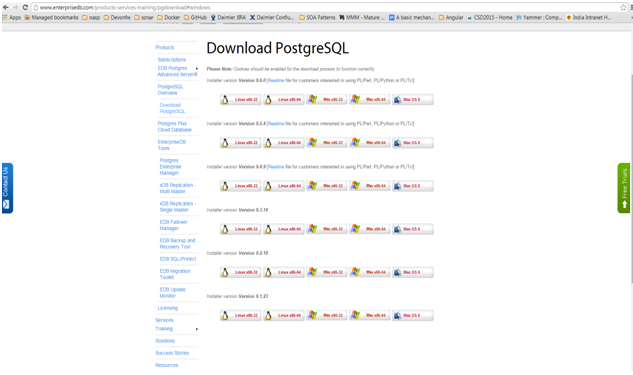
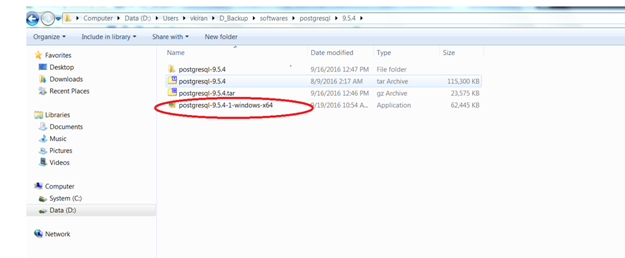
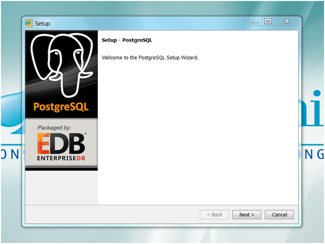
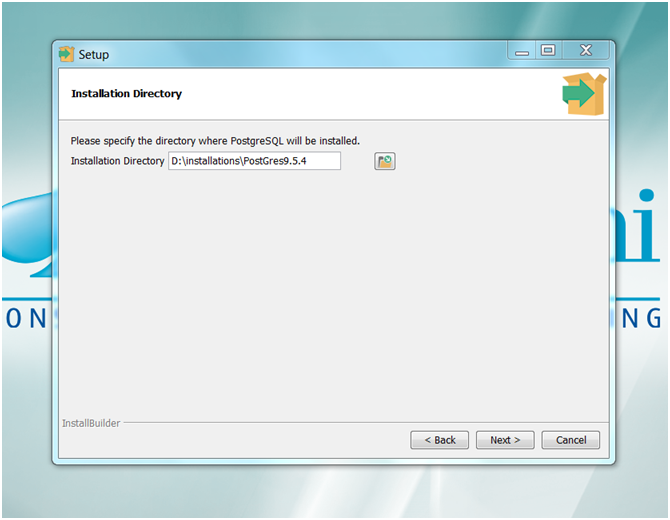
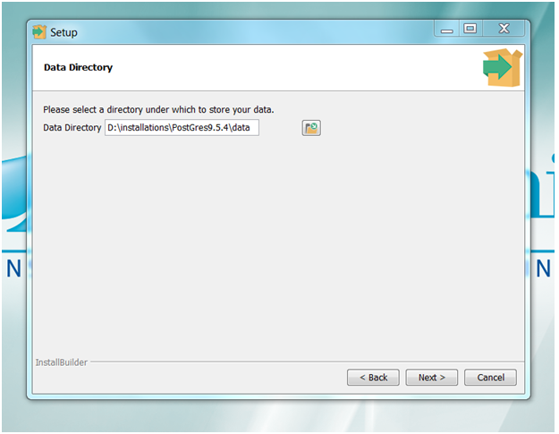
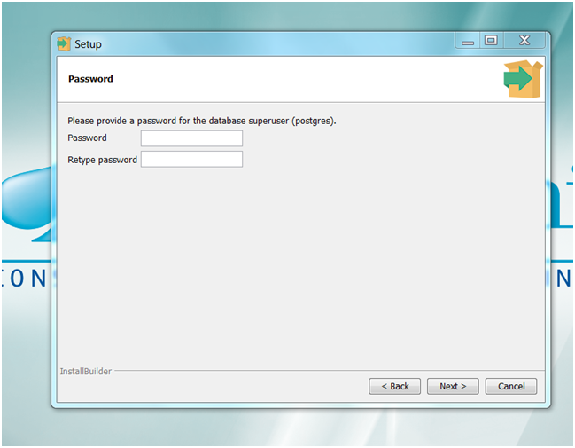
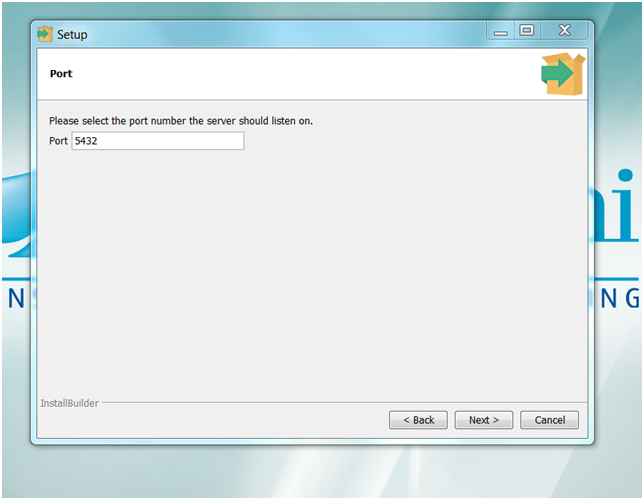
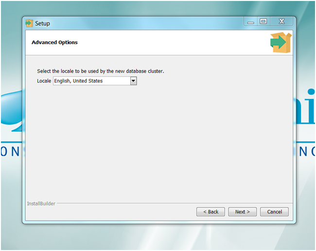
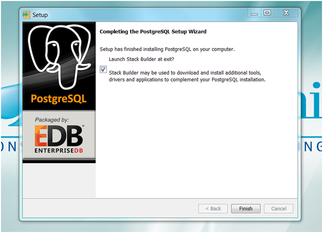

:toc: macro
toc::[]

##Guide for DBIntegration of PostGres Server

devon4j is by default configured with the H2 Databse.  

As a first step to integrate devon4j with the PostGres 9.5.4, PostGres 9.5.4 has to be installed. Following are the snapshots of the configuration chosen during various stages of installation . 

*Note* : One can ignore the following section if they are well versed with the installation process  of PostGres 9.5.4. 

## PostGres Installation and Configuration using Docker

In order to have a Postgres up and running with docker we can execute
[source,bash]
--------
docker run --name postgres -p 5432:5432 -e POSTGRES_PASSWORD=mysecretpassword -d postgres:9.5.4
--------

This makes Postgres avaiable on the docker-machine host on port 5432. If using docker on windows with docker toolbox it usually means that Postgres will be on 192.168.99.100 (please check the IP of your docker machine)

So the configuration for the datasource url strig will be: 

`jdbc:postgresql://192.168.99.100:5432/mydb?currentSchema=devon4j`

To check the installation or to have an interactive query tool with Postgres we can run another docker process like this:
[source,bash]
--------
docker run -it --rm --link postgres:postgres postgres psql -h postgres -U postgres
--------

Now we can create the databas and schema by running on the psql console

[source,bash]
--------
create database mydb;
create schema devon4j;
--------

## PostGres Installation and Configuration  

•	Download *PostGres 9.5.4* for Windows 64 bit Operating System from http://www.enterprisedb.com/products-services-training/pgdownload#windows[here]. Screenshot of the download page below.

 

•	Once installable for *PostGres 9.5.4* is downloaded , click on the installable  to start the installation process.It is shown in the below screenshot.

•	The ‘Setup’ Wizard starts with screen shown below. Click Next button.

•	In the next step, select installation directory path and click Next button

•	In the next step, select data directory path and click Next button.

•	In the next step, enter the password for PostGres and click Next button.

•	In the next step, enter the port for PostGres and click Next button.

•	In the next step, select the Locale for PostGres and click Next button.

•	In the next step, select the check box for launching the *Stack Builder* if needed and click Finish button.

## Enabling PostGres and disabling H2 Database

•	Add an entry similar to the following entry in 'IPv4 local connections' section in  pg_hba.conf file that is located inside 'data' directory of PostGres installation. For instance , if the installation path of PostGres is D:\installations\PostGres9.5.4 , path of pg_hba.conf will be D:\installations\PostGres9.5.4\data\pg_hba.conf

[source,java]
--------
host    all             postgres        10.102.114.142/32       trust
--------

In the above entry , replace the IP details with details of your machine. 

•	Assuming the schema created under *PostGres* database *mydb* is *devon4j*, execute the following script to create Flyway MetaData Table *schema_version* in the schema devon4j.

[source,java]
--------
-- Table: devon4j.schema_version

-- DROP TABLE devon4j.schema_version;

CREATE TABLE devon4j.schema_version
(
  version_rank integer NOT NULL,
  installed_rank integer NOT NULL,
  version character varying(50) NOT NULL,
  description character varying(200) NOT NULL,
  type character varying(20) NOT NULL,
  script character varying(1000) NOT NULL,
  checksum integer,
  installed_by character varying(100) NOT NULL,
  installed_on timestamp without time zone NOT NULL DEFAULT now(),
  execution_time integer NOT NULL,
  success boolean NOT NULL,
  CONSTRAINT schema_version_pk PRIMARY KEY (version)
)
WITH (
  OIDS=FALSE
);
ALTER TABLE devon4j.schema_version
  OWNER TO postgres;

-- Index: devon4j.schema_version_ir_idx

-- DROP INDEX devon4j.schema_version_ir_idx;

CREATE INDEX schema_version_ir_idx
  ON devon4j.schema_version
  USING btree
  (installed_rank);

-- Index: devon4j.schema_version_s_idx

-- DROP INDEX devon4j.schema_version_s_idx;

CREATE INDEX schema_version_s_idx
  ON devon4j.schema_version
  USING btree
  (success);

-- Index: devon4j.schema_version_vr_idx

-- DROP INDEX devon4j.schema_version_vr_idx;

CREATE INDEX schema_version_vr_idx
  ON devon4j.schema_version
  USING btree
  (version_rank);

--------

•	Uncomment *Type* annotation for ‘data’ attribute in devon4j-sample-core/src/main/java/io/oasp/gastronomy/restaurant/general/dataacess/api/_BinaryObjectEntity.java_

[source,java]
--------
@Type(type = "org.hibernate.type.BinaryType")
public Blob getData() {
--------

•	Uncomment the dependency for the PostGres 9.5.4 jdbc driver in devon4j-sample-core/_pom.xml_. Dependency for PostGres 9.5.4 is as follows :

[source,java]
--------
<dependency>
      <groupId>org.postgresql</groupId>
      <artifactId>postgresql</artifactId>
      <version>9.4.1211.jre7</version>
</dependency> 
--------

•	Change the value of following property ‘spring.datasource.url’ in following file ‘devon4j-sample-core/src/main/resources/config/_application-postgre.properties_’. Accordingly, change the following properties:
   * Hostname
   * Port
   * Database Name
   * spring.datasource.username
   * spring.datasource.password

•	Run the script core/src/test/setup/postgresdb.bat for Windows Environment and the script core/src/test/setup/postgresdb.sh for Unix/Linux Environments.

•	Make a copy of _bills.csv_at following path devon4j-sample-core/src/test/resources/BillExportJobTest/expected/ and rename it to _bills_h2.csv_

•	Rename the file _bills_pg.csv_  in devon4j-sample-core/src/test/resources/BillExportJobTest/expected/ to _bills.csv_

•	Comment the spring active profile *h2mem* and uncomment the spring active profile *postgre* in devon4j-sample-core/src/main/resources/config/_application.properties_.

•	Comment the line that has spring active profile *junit* and comment the line that has spring active profiles *junit* and *postgre* separated by comma in the file devon4j-sample-core/src/test/resources/config/_application.properties_.

*Note* : Make sure that JUNIT Test cases run successfully for devon4j Project using the command *‘mvn clean install’*.

Assuming that devon4j is integrated with the PostGres 9.5.4, following are the steps to enable H2 Database.

## Disabling PostGres and enabling H2 Database

•	Comment *Type* annotation for ‘data’ attribute in devon4j-sample-core/src/main/java/io/oasp/gastronomy/restaurant/general/dataacess/api/_BinaryObjectEntity.java_

[source,java]
--------
//@Type(type = "org.hibernate.type.BinaryType")
public Blob getData() {
--------

•	Comment the dependency for the PostGres 9.5.4 jdbc driver in devon4j-sample-core/_pom.xml_. Commented code below.

[source,java]
--------
<!--
    <dependency>
      	<groupId>org.postgresql</groupId>
      	<artifactId>postgresql</artifactId>
      	<version>9.4.1211.jre7</version>
    </dependency> 
-->
--------

•	Run the script core/src/test/setup/disablepostgresdb.bat for Windows Environment and the script core/src/test/setup/disablepostgresdb.sh for Unix/Linux Environments.

•	Make a copy of _bills.csv_ at following path devon4j-sample-core/src/test/resources/BillExportJobTest/expected/ and rename it to _bills_pg.csv_

•	Rename _bills_h2.csv_  in devon4j-sample-core/src/test/resources/BillExportJobTest/expected/ to _bills.csv_

•	Uncomment the spring active profile *h2mem* and comment the spring active profile *postgre* in devon4j-sample-core/src/main/resources/config/_application.properties_

•	Uncomment the line that has spring active profile *junit* and comment the line that has spring active profiles *junit* and *postgre* separated by comma in the file devon4j-sample-core/src/test/resources/config/_application.properties_ 

*Note:* Make sure that JUNIT Test cases run successfully for devon4j Project using the command *‘mvn clean install’*.

## Run the sample application with the Angular JS Client 

•	Follow the steps mentioned https://github.com/devonfw/devon/wiki/Client-GUI-Angular-run-oasp4js[here]

## Run the sample application with the Sencha Client 

•	Follow the steps mentioned https://github.com/devonfw/devon/wiki/getting-started-deployment-on-tomcat[here]  

**Note** : One has to recompile devon4j project by executing the command *mvn clean install* in *devon4j* project after doing the changes mentioned in the above said instructions.   