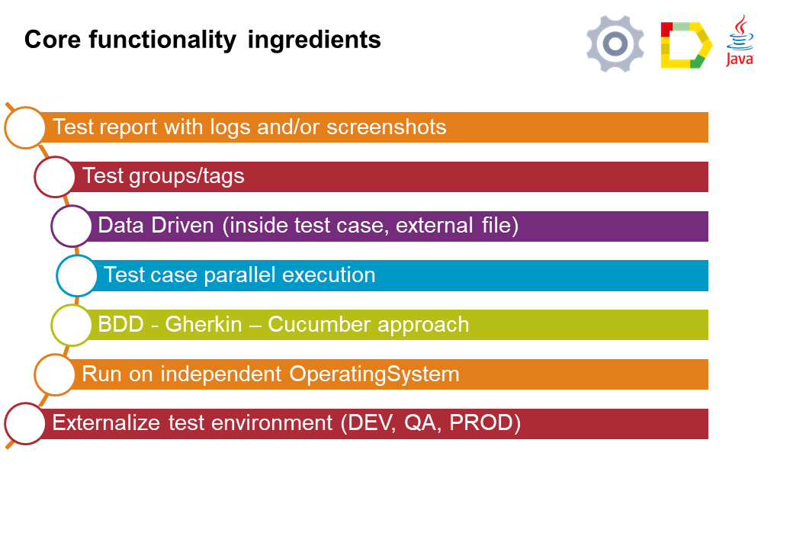

:toc: macro

ifdef::env-github[]
:tip-caption: :bulb:
:note-caption: :information_source:
:important-caption: :heavy_exclamation_mark:
:caution-caption: :fire:
:warning-caption: :warning:
endif::[]

toc::[]
:idprefix:
:idseparator: -
:reproducible:
:source-highlighter: rouge
:listing-caption: Listing

== Core Test Module

==  What is Core Test Module

==  Core Test Module Functions

* https://github.com/devonfw/devonfw-testing/blob/develop/documentation/Who-Is-MrChecker/Test-Framework-Modules/Core-Test-Module-Test-reports-with-logs-and-or-screenshots.adoc[Test reports with logs and/or screenshots]
* https://github.com/devonfw/devonfw-testing/blob/develop/documentation/Who-Is-MrChecker/Test-Framework-Modules/Core-Test-Module-test-groups-tags.adoc[Test groups/tags]
* https://github.com/devonfw/devonfw-testing/blob/develop/documentation/Who-Is-MrChecker/Test-Framework-Modules/Core-Test-Module-Data-driven-approach.adoc[Data driven approach]
* https://github.com/devonfw/devonfw-testing/blob/develop/documentation/Who-Is-MrChecker/Test-Framework-Modules/Core-Test-Module-Test-case-parallel-execution.adoc[Test case parallel execution]
* https://github.com/devonfw/devonfw-testing/blob/develop/documentation/Who-Is-MrChecker/Test-Framework-Modules/Core-Test-Module-BDD-Gherkin-Cucumber-approach.adoc[BDD - Gherkin - Cucumber approach]
* https://github.com/devonfw/devonfw-testing/blob/develop/documentation/Who-Is-MrChecker/Test-Framework-Modules/Core-Test-Module-Run-on-independent-Operating-Systems.adoc[Run on independent Operating Systems]
* https://github.com/devonfw/devonfw-testing/blob/develop/documentation/Who-Is-MrChecker/Test-Framework-Modules/Core-Test-Module-Externalize-test-environment-DEV-QA-SIT-PROD.adoc[Externalize test environment (DEV, QA, SIT, PROD)]
* https://github.com/devonfw/devonfw-testing/blob/develop/documentation/Who-Is-MrChecker/Test-Framework-Modules/Core-Test-Module-Different-Environments.adoc[Encrypting sensitive data]

==  How to start?

Read: https://github.com/devonfw/devonfw-testing/blob/develop/documentation/Who-Is-MrChecker/Test-Framework-Modules/Core-Test-Module-Framework-Test-Class.adoc[Framework Test Class]
